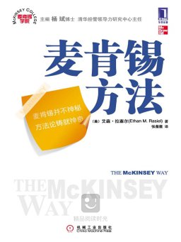

## 2014年读过的书们

总结一下2014年读过的书，之后有空挑几本好书写写书评好了。

##### 1-5、 十四分之一

开篇很精彩和神奇的小说，而且一口气能看好多个惊悚故事呢。0.0

##### 6、和抑郁的自己聊聊吧

讲了些抑郁的成因以及解决方法吧，挺有帮助的。

##### 7、盛夏方程式

东野圭吾，你懂的。

##### 8、改变未来的九大算法

个人感觉是对IT业的一个科普吧，讲解了一些流行技术的算法支撑。

##### 9、MacTalk·人生元编程

嘿嘿，这个不用多做介绍了吧。准备重读一遍。

##### 10、别相信任何人

有点惊悚的一本小说，后来看了记忆碎片，觉得（这本书）结局“好”多了。

##### 11、拖拉一点也无妨

讲如何利用拖延心理完成事情的一本书，心理慰藉也好，GTD也罢，还是有不小用处。

##### 12、古董局中局

亲王小说好顶赞。

##### 13、古董局中局2

同上。

##### 14-18、西夏死书

似乎是类似盗墓类的小说==，之前没看过，消磨时间的。

##### 19、我编程，我快乐（程序员的职业规划之道）

先看看，以后重读看看有没有道理哈哈。这本书指出了程序员一些学习和工作需要注意的事项吧。

##### 20、玄局

讲风水命理的小说，感觉一般般。

##### 21-23、教父

经典啊哈哈，第一部和第二比较赞，感觉第三部稍微差一点。

##### 24、一分钟能做什么

先囫囵吞枣过了一遍，有不少鸡汤和小方法，之后再读一遍。

##### 25、理解Unix进程

基本上是在公车上看完的。看完后加深了对unix进程的理解吧，这部书的样例代码是用ruby写的，挺不错的。(虽然api长得都差不多一样）

##### 26、浮华背后

和小时候看的一部电视剧一样名字的小说，印象中的电视剧比小说要精彩。

##### 27、他的国

很不错的一本小说，岳父出品，必属精品。（会告诉你刚看完的时候很有感悟，现在好像快忘光了）

##### 28、司马懿：谁结束了三国？

总结了司马懿的一生，用近似小说的笔法平铺直叙，还是挺好的。（对我这种历史渣）

##### 29、希区柯克悬疑经典集

悬疑小说集，虽然其中好多惊悚梗都在别的地方看过来，借鉴取材很严重嘛。（我是说别的地方。）

##### 30、程序员的思维训练

0.0这本书让我开始在有空的时候用签字笔素描，以后还是得重读一遍。

##### 31、麦肯锡方法

更适合商科的同学读，可以借鉴一些工作方法和职场上注意的事项吧。

##### 32-33、大漠苍狼

小说，盗墓？考古？mix时间元素，感觉还是很不错的。

##### 34、Redis设计与实现

看完后大概知道redis是怎么回事了，用的时候也会更有把握了。

##### 35、SQL反模式

很不错的一本sql方面的经验谈吧，避免以后踩坑，可以当工具书查。

##### 36、笑侃NBA

杨毅老师评书式的述说NBA的一些人物。