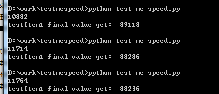
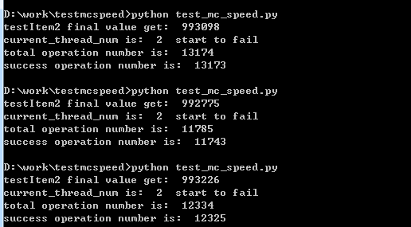
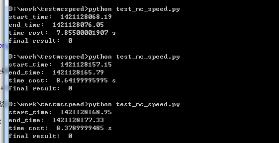

## 关于Memcached 乐观锁(cas)操作的性能测试

###### wangzr

### 关于CAS的说明

CAS，又称Compare-and-Swap，是一种原子操作。

Memcached的cas使用方式为，首先使用gets指令获取一个key对应的value值，然后根据业务逻辑改动value的值，最后使用cas指令提交key-value对，并附带版本号。（其中，该版本号对于业务编程一般是透明的，不可感知）。

当mc服务端接收到cas指令后，取出对应key在服务端当前的版本号和cas指令中key-value对的版本号，两者作比较，若不同，则本次cas操作失败，即乐观锁的实现。

有关[乐观锁的资料](http://zh.wikipedia.org/wiki/%E4%B9%90%E8%A7%82%E5%B9%B6%E5%8F%91%E6%8E%A7%E5%88%B6)

#### mc中cas的实现

[](http://blog.csdn.net/yxnyxnyxnyxnyxn/article/details/7877275)

以下是简单地概括。

* mc为每个key生成一个64位整数版本号保存在item中。
* cas机制的开启根据配置文件中settings.use_cas项来确定，默认是开启的。
* mc的incr和decr指令，实际上也会使用cas机制。
* append/prepend操作也会涉及cas的相关操作。

#### 针对性能测试

测试目的：为了验证代金卷发放逻辑后续实现方案的设计。（多物理机并发处理时当前逻辑为锁表行，速度相对较慢，约30条/秒）

测试条目：

1. 单线程时 mc cas的每秒操作量。
2. 并发到多少线程，cas开始不成功。
3. 多线程并发（2，……，50,75,100）的时候，cas的速率如何，cas的成功率如何？

测试期待目标：
1. 单线程mc cas操作期待最小到70，能大于100更好

测试实施方案：

> 因为客户端的任务其实主要是将函数调用解析为相应的字符串命令，然后发送给mc服务端，所以为了测试方案的快速实施，这里我们采用python作为测试语言，采用python-memcached模块作为mc客户端，使用*.*.*.*:*作为mc服务端。

测试条目一方案代码：

```
def Test1():
    mc = connect(mc_ip,mc_port)
    mc.delete('testItem1')
    mc.set('testItem1',100000)
    t = time.time()
    total = 0
    while time.time() - t < 10:
        a = mc.gets('testItem1')
        a = a - 1
        mc.cas('testItem1',a)
        total += 1
    print total
    print "testItem1 final value get: ",mc.get('testItem1')
```

测试条目一方案结果：


#####测试结论
可以看到，10秒内平均能执行11000+次，即每秒平均约1000次。


在此之前，我们先引入多线程编程的python类。

```
class Timer(threading.Thread):
    def __init__(self,fn,args=(),sleep=0,threadId=0,lastDo=True):
        threading.Thread.__init__(self)
        self.fn = fn
        self.args = args
        self.sleep = sleep
        self.lastDo = lastDo
        self.threadId = threadId
        self.setDaemon(True)

        self.oper = 0
        self.success = 0
         
        self.isPlay = True
        self.fnPlay = False
     
    def __do(self):
        self.fnPlay = True
        rs = apply(self.fn,self.args)
        self.oper += 1
        if rs is True:
            self.success += 1
        self.fnPlay = False
     
    def run(self):
        while self.isPlay :
            #time.sleep(self.sleep)
            self.__do()
     
    def stop(self):
        #stop the loop
        self.isPlay = False
        while True:
            if not self.fnPlay : break
            time.sleep(0.01)
        #if lastDo,do it again
        if self.lastDo : self.__do()
        # hook function 
        return {"success_num":self.success,"operation":self.oper}
	
```

测试条目二方案代码：

```
def Test2()：
    mc = connect(mc_ip,mc_port)
    mc.set('testItem2',100000)
    current_thread_num = 2 
    is_fail = False
    while True:  
        mc.delete('testItem2')
        mc.set('testItem2',1000000)
        arr = []
        for i in xrange(0,current_thread_num):
            nmc = connect(mc_ip,mc_port) 
            args = []
            args.append(nmc)
            t = Timer(threadFun2,args,0.00001,i,False) 
            arr.append(t)
        st_time = time.time()
        for item in arr:
            item.start()
        while time.time() - st_time < 10:
            pass
        stats = []
        for item in arr:
            stat = item.stop()
            stats.append(stat)

        print "testItem2 final value get: ",mc.get('testItem2')
        total_oper = 0
        success_num = 0
        for item in stats: 
            total_oper += item["operation"] 
            success_num += item["success_num"]
            if item["success_num"] != item["operation"]:
                is_fail = True 
        if is_fail is True:
            break
        current_thread_num += 1
    print "current_thread_num is: ",current_thread_num ," start to fail"
    print "total operation number is: ",total_oper
    print "success operation number is: ",success_num
            

def threadFun2(mc):
    #mc = args[0]
    v = mc.gets('testItem2')
    v = v - 1
    mc.cas('testItem2',v)
    nv = mc.get('testItem2')
    if nv != v:
        return False
    return True
```

测试条目二结果：



#####测试结论
对于结果的结论，2条线程并发操作mc时，开始出现cas失败的情况。

失败的概率在(13173+11743+12325)/(13174+11785+12325) = 99.88%

另外，在2条线程的情况下，速率稍有提高。

测试条目三方案代码：

```
def Test3(thread_num):
    mc = connect(mc_ip,mc_port)
    mc.delete('testItem3')
    print "==========thread_num ",thread_num,"============"
    mc.set('testItem3',1000)
    arr = []
    for i in xrange(0,thread_num):
        nmc = connect(mc_ip,mc_port)
        args = []
        args.append(nmc)
        t = Timer(threadFun3,args,0.001,i,False)
        arr.append(t)
    st_time = time.time()
    for item in arr:
        item.start()
    while time.time() - st_time < 5:
        pass
    success_num = 0
    total_num = 0
    stats = []
    for item in arr:
        stat = item.stop() 
        stats.append(stat)
    for stat in stats:
        success_num += stat["success_num"]
        total_num += stat["operation"]
    print "total operation number/s is: ",total_num / 5
    print "success opertaion number/s is: ",success_num / 5
    print "success operation rate is: ",float(success_num)/float(total_num)
    print "==========thread_num ",thread_num,"=============="
    print ""
    
    #v = mc.gets('herokingsley') 

    while  mc.get('herokingsley') > 0:
        pass
    for item in arr:
        item.stop()

   
def threadFun3(mc):
    #mc = connect(mc_ip,mc_port)
    a = mc.gets('testItem3')
    a = a - 1
    #print type(a)
    #print a
    rs = mc.cas('testItem3',a)
    if rs is False:
        print "have a false"
    nv = mc.get('testItem3')
    if nv != a:
        return False
    return True
```

测试结果：
```
==========thread_num  2 ============
total operation number/s is:  944
success opertaion number/s is:  944
success operation rate is:  1.0
==========thread_num  2 ==============

==========thread_num  3 ============
total operation number/s is:  1828
success opertaion number/s is:  1742
success operation rate is:  0.952865266842
==========thread_num  3 ==============

==========thread_num  4 ============
total operation number/s is:  2037
success opertaion number/s is:  1793
success operation rate is:  0.880216003927
==========thread_num  4 ==============

==========thread_num  5 ============
total operation number/s is:  2580
success opertaion number/s is:  2097
success operation rate is:  0.81274221051
==========thread_num  5 ==============

==========thread_num  6 ============
total operation number/s is:  2895
success opertaion number/s is:  2120
success operation rate is:  0.73214532394
==========thread_num  6 ==============

==========thread_num  7 ============
total operation number/s is:  3214
success opertaion number/s is:  2229
success operation rate is:  0.693566450971
==========thread_num  7 ==============

==========thread_num  8 ============
total operation number/s is:  3267
success opertaion number/s is:  2222
success operation rate is:  0.680195898378
==========thread_num  8 ==============

==========thread_num  9 ============
total operation number/s is:  3391
success opertaion number/s is:  2284
success operation rate is:  0.673645102318
==========thread_num  9 ==============

==========thread_num  50 ============
total operation number/s is:  3833
success opertaion number/s is:  1783
success operation rate is:  0.465198789523
==========thread_num  50 ==============

==========thread_num  75 ============
total operation number/s is:  4285
success opertaion number/s is:  1939
success operation rate is:  0.452466514211
==========thread_num  75 ==============

==========thread_num  100 ============
total operation number/s is:  4487
success opertaion number/s is:  1968
success operation rate is:  0.438541759515
==========thread_num  100 ==============
```

#####测试结论

成功率随并发的线程数量增加而减少，每秒cas操作成功的最多次数为2200+次，线程为7、8条左右。

由于time.time()存在开销，为去掉time.time()的开销，下面补充一些测试：

测试代码：

```
def Test4():
    mc = connect(mc_ip,mc_port)
    mc.delete('testItem4')
    mc.set('testItem4',10000)
    st = time.time()
    total = 0
    while total < 10000:
        a = mc.gets('testItem4')
        a = a - 1
        mc.cas('testItem4',a)
        total += 1
    en = time.time()
    print "start_time: ",st
    print "end_time: ",en
    print "time cost: ",en-st,"s"
    print "final result: ",mc.get('testItem4')
```


测试结果:



#####测试结论

平均一秒能执行：1219.51219512次左右。

